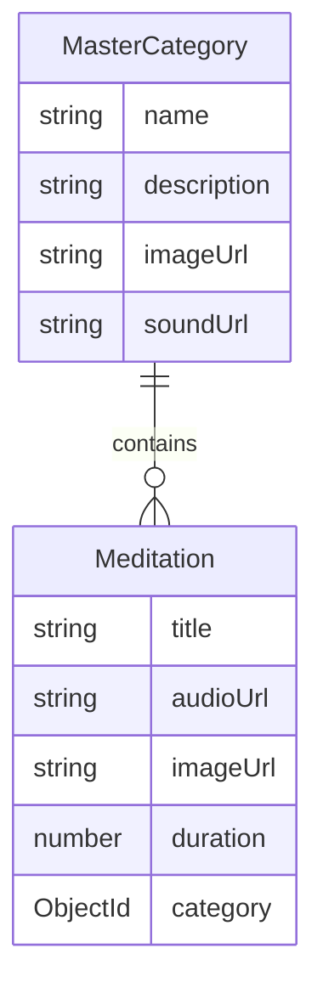

# Relationship: MasterCategory & Meditation

This document explains how the `MasterCategory` and `Meditation` models are connected in the meditation app.

---

## 1. Overview

- **MasterCategory**: Represents a category/group (e.g., "Pranayama Classes", "Mantra Chanting").
- **Meditation**: Represents an individual meditation session (e.g., "Body Scan Meditation").
- **Connection**: Each Meditation references a MasterCategory using the `category` field (MongoDB ObjectId).

---

## 2. Schema Reference

**In Meditation model:**
```js
category: {
  type: mongoose.Schema.Types.ObjectId,
  ref: 'MasterCategory',
  required: true,
}
```

---

## 3. Example Documents

**MasterCategory:**
```json
{
  "_id": "60f7c2b8e1d2c8a1b2c3d4e5",
  "name": "Mantra Chanting",
  "description": "Chanting for relaxation and focus.",
  "imageUrl": "https://example.com/images/mantra.jpg",
  "soundUrl": "https://example.com/sounds/mantra.mp3"
}
```

**Meditation:**
```json
{
  "title": "Rainforest Waterfall",
  "category": "60f7c2b8e1d2c8a1b2c3d4e5",
  "audioUrl": "https://example.com/audio/rainforest.mp3",
  "imageUrl": "https://example.com/images/rainforest.jpg",
  "duration": 30,
  "level": "All Levels"
}
```

---

## 4. Sample Queries

**Find all meditations in a category:**
```js
const meditations = await Meditation.find({ category: masterCategoryId });
```

**Populate category details in a meditation:**
```js
const meditation = await Meditation.findById(meditationId).populate('category');
```

---

## 5. Diagram



---

## 6. Summary

- **MasterCategory** is the parent/group.
- **Meditation** is the child/item, referencing its parent via the `category` field.
- This allows you to group, filter, and display meditations by category in your UI, just like in your Figma images. 