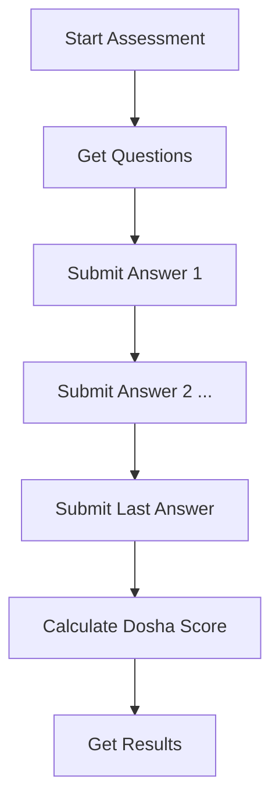

# Dosha Assessment API Guide

This document describes the **Dosha Assessment** API endpoints for user-facing Prakriti and Vikriti assessments, running in parallel to the admin/question management endpoints.

---

## 1. Overview

- **Purpose:** Allow users to take Prakriti (birth constitution) and Vikriti (current state) dosha assessments.
- **Questions & Options:** Managed by the QuestionMaster (admin only). Users fetch questions, submit answers, and receive dosha results.
- **Models Used:**
  - `QuestionMaster` (questions/options)
  - `AssessmentResult` (user answers/results)

---

## 2. API Endpoints

### 2.1 Start Assessment
- **POST** `/v1/doshas/assessments/start`
- **Body:**
```json
{
  "assessmentType": "Prakriti" // or "Vikriti"
}
```
- **Response:** Assessment object (with ID)

### 2.2 Get Assessment Questions
- **GET** `/v1/doshas/assessments/questions/:assessmentType`
- **Params:** `assessmentType` = Prakriti | Vikriti
- **Response:** Array of questions (with options)

### 2.3 Submit Answer
- **POST** `/v1/doshas/assessments/submit-answer`
- **Body:**
```json
{
  "assessmentId": "<assessment_id>",
  "questionId": "<question_id>",
  "selectedOptionIndex": 0 // index of selected option
}
```
- **Response:** Updated assessment object

### 2.4 Calculate Dosha Score
- **POST** `/v1/doshas/assessments/:assessmentId/calculate`
- **Response:** Assessment object with dosha scores

### 2.5 Get Assessment Results (History)
- **GET** `/v1/doshas/assessments`
- **Query:** `assessmentType` (optional)
- **Response:** Array of assessment results

### 2.6 Get Assessment by ID
- **GET** `/v1/doshas/assessments/:assessmentId`
- **Response:** Assessment result object

---

## 3. Postman Usage Guide

### 3.1 Authentication
- **If endpoints are protected:**
  - Obtain JWT token via login endpoint
  - Add `Authorization: Bearer <token>` header to all requests

### 3.2 Example Workflow

#### 1. Start Assessment
- **POST** `/v1/doshas/assessments/start`
- **Body:** `{ "assessmentType": "Prakriti" }`
- **Save** `assessmentId` from response

#### 2. Get Questions
- **GET** `/v1/doshas/assessments/questions/Prakriti`
- **Use** question IDs and options for next step

#### 3. Submit Answers (repeat for each question)
- **POST** `/v1/doshas/assessments/submit-answer`
- **Body:**
```json
{
  "assessmentId": "...",
  "questionId": "...",
  "selectedOptionIndex": 1
}
```

#### 4. Calculate Dosha Score
- **POST** `/v1/doshas/assessments/<assessmentId>/calculate`
- **Response:** Dosha scores (e.g., `{ vata: 5, pitta: 3, kapha: 2 }`)

#### 5. Get Results
- **GET** `/v1/doshas/assessments`
- **GET** `/v1/doshas/assessments/<assessmentId>`

---

## 4. Data Model Reference

### QuestionMaster (Admin)
```js
{
  assessmentType: 'Prakriti' | 'Vikriti',
  questionText: String,
  options: [
    { text: String, dosha: 'Vata'|'Pitta'|'Kapha', description: String }
  ],
  order: Number,
  isActive: Boolean
}
```

### AssessmentResult (User)
```js
{
  userId: ObjectId,
  assessmentType: 'Prakriti' | 'Vikriti',
  answers: [
    { questionId: ObjectId, selectedOptionIndex: Number }
  ],
  doshaScore: { vata: Number, pitta: Number, kapha: Number },
  isCompleted: Boolean,
  submittedAt: Date
}
```

---

## 5. Flow Diagram



---

## 6. Notes
- **Admin** manages questions via `/v1/questionMaster/questions` endpoints.
- **User** interacts only with `/v1/doshas/assessments/*` endpoints for assessment flow.
- All endpoints require authentication unless marked public.

---

**Ready to use in Postman!**
- Import these endpoints, set your auth token, and follow the workflow above. 