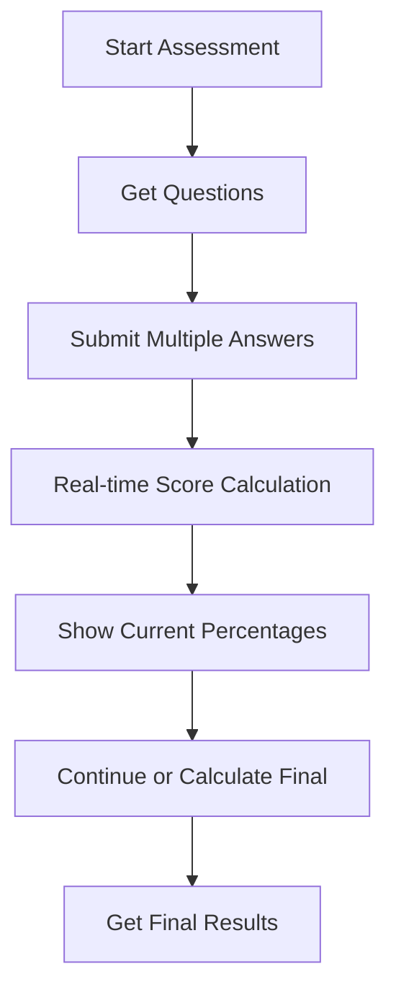

# Dosha Assessment API Guide

This document describes the **Dosha Assessment** API endpoints for user-facing Prakriti and Vikriti assessments, running in parallel to the admin/question management endpoints.

---

## 1. Overview

- **Purpose:** Allow users to take Prakriti (birth constitution) and Vikriti (current state) dosha assessments.
- **Questions & Options:** Managed by the QuestionMaster (admin only). Users fetch questions, submit answers, and receive dosha results.
- **Authentication:** All endpoints require JWT token authentication.
- **Real-time Scoring:** Dosha scores and percentages are calculated automatically after each answer submission.
- **Models Used:**
  - `QuestionMaster` (questions/options)
  - `AssessmentResult` (user answers/results)

---

## 2. API Endpoints

### 2.1 Start Assessment
- **POST** `/v1/doshas/assessments/start`
- **Headers:** `Authorization: Bearer <token>`
- **Body:**
```json
{
  "assessmentType": "Prakriti" // or "Vikriti"
}
```
- **Response:** Assessment object with `_id` (this is your assessmentId)
```json
{
  "_id": "64a1b2c3d4e5f6a7b8c9d0e1",
  "userId": "64a1b2c3d4e5f6a7b8c9d0e2",
  "assessmentType": "Prakriti",
  "answers": [],
  "doshaScore": { "vata": 0, "pitta": 0, "kapha": 0 },
  "doshaPercentages": { "vata": 0, "pitta": 0, "kapha": 0 },
  "isCompleted": false
}
```

### 2.2 Get Assessment Questions
- **GET** `/v1/doshas/assessments/questions/:assessmentType`
- **Headers:** `Authorization: Bearer <token>` (optional - public endpoint)
- **Params:** `assessmentType` = Prakriti | Vikriti
- **Response:** Array of questions (with options)

### 2.3 Submit Multiple Answers
- **POST** `/v1/doshas/assessments/submit-answer`
- **Headers:** `Authorization: Bearer <token>`
- **Body:**
```json
{
  "assessmentId": "64a1b2c3d4e5f6a7b8c9d0e1", // ← From startAssessment response
  "answers": [
    {
      "questionId": "686d72a4c1a07d15d85114dc", // ← From getQuestions response
      "selectedOptionIndex": 0
    },
    {
      "questionId": "686d72a4c1a07d15d85114e0",
      "selectedOptionIndex": 1
    }
    // ... more answers
  ]
}
```
- **Response:** Updated assessment object with calculated scores and percentages
```json
{
  "_id": "64a1b2c3d4e5f6a7b8c9d0e1",
  "userId": "64a1b2c3d4e5f6a7b8c9d0e2",
  "assessmentType": "Prakriti",
  "answers": [...],
  "doshaScore": { "vata": 3, "pitta": 5, "kapha": 2 },
  "doshaPercentages": { "vata": 30, "pitta": 50, "kapha": 20 },
  "isCompleted": false
}
```

### 2.4 Calculate Dosha Score (Final)
- **POST** `/v1/doshas/assessments/:assessmentId/calculate`
- **Headers:** `Authorization: Bearer <token>`
- **Response:** Assessment object with final dosha scores and percentages, marked as completed

### 2.5 Get Assessment Results (History)
- **GET** `/v1/doshas/assessments`
- **Headers:** `Authorization: Bearer <token>`
- **Query:** `assessmentType` (optional)
- **Response:** Array of assessment results

### 2.6 Get Assessment by ID
- **GET** `/v1/doshas/assessments/:assessmentId`
- **Headers:** `Authorization: Bearer <token>`
- **Response:** Assessment result object

---

## 3. Postman Usage Guide

### 3.1 Authentication
- **Required for all endpoints (except get questions):**
  - Obtain JWT token via login endpoint
  - Add `Authorization: Bearer <token>` header to all requests

### 3.2 Complete Example Workflow

#### 1. Start Assessment
- **POST** `/v1/doshas/assessments/start`
- **Headers:** `Authorization: Bearer <your_token>`
- **Body:** `{ "assessmentType": "Prakriti" }`
- **Save** `_id` from response as your `assessmentId`

#### 2. Get Questions
- **GET** `/v1/doshas/assessments/questions/Prakriti`
- **Headers:** `Authorization: Bearer <your_token>` (optional)
- **Save** question `id` values for answers

#### 3. Submit Multiple Answers (Real-time scoring)
- **POST** `/v1/doshas/assessments/submit-answer`
- **Headers:** `Authorization: Bearer <your_token>`
- **Body:**
```json
{
  "assessmentId": "64a1b2c3d4e5f6a7b8c9d0e1",
  "answers": [
    { "questionId": "686d72a4c1a07d15d85114dc", "selectedOptionIndex": 0 },
    { "questionId": "686d72a4c1a07d15d85114e0", "selectedOptionIndex": 1 },
    { "questionId": "686d72a4c1a07d15d85114e4", "selectedOptionIndex": 2 },
    { "questionId": "686d72a4c1a07d15d85114e8", "selectedOptionIndex": 0 },
    { "questionId": "686d72a4c1a07d15d85114ec", "selectedOptionIndex": 1 }
  ]
}
```
- **Response:** Updated assessment with current scores and percentages

#### 4. Calculate Final Dosha Score
- **POST** `/v1/doshas/assessments/64a1b2c3d4e5f6a7b8c9d0e1/calculate`
- **Headers:** `Authorization: Bearer <your_token>`
- **Response:** Final dosha scores and percentages, marked as completed

#### 5. Get Results
- **GET** `/v1/doshas/assessments`
- **Headers:** `Authorization: Bearer <your_token>`
- **GET** `/v1/doshas/assessments/64a1b2c3d4e5f6a7b8c9d0e1`
- **Headers:** `Authorization: Bearer <your_token>`

---

## 4. Data Model Reference

### QuestionMaster (Admin)
```js
{
  assessmentType: 'Prakriti' | 'Vikriti',
  questionText: String,
  options: [
    { text: String, dosha: 'Vata'|'Pitta'|'Kapha', description: String }
  ],
  order: Number,
  isActive: Boolean
}
```

### AssessmentResult (User)
```js
{
  userId: ObjectId,
  assessmentType: 'Prakriti' | 'Vikriti',
  answers: [
    { questionId: ObjectId, selectedOptionIndex: Number }
  ],
  doshaScore: { vata: Number, pitta: Number, kapha: Number },
  doshaPercentages: { vata: Number, pitta: Number, kapha: Number },
  isCompleted: Boolean,
  submittedAt: Date
}
```

---

## 5. Flow Diagram



---

## 6. Notes
- **Authentication:** All endpoints require JWT token except `getAssessmentQuestions` (optional).
- **Real-time Scoring:** Dosha scores and percentages are calculated automatically after each answer submission.
- **Percentages:** Returned as whole numbers (e.g., 30, 50, 20 for 30%, 50%, 20%).
- **Bulk Submit:** You can submit multiple answers in one request for better performance.
- **assessmentId:** Comes from the `_id` field in the startAssessment response.
- **questionId:** Comes from the `id` field in each question from getQuestions response.
- **Admin** manages questions via `/v1/questionMaster/questions` endpoints.
- **User** interacts only with `/v1/doshas/assessments/*` endpoints for assessment flow.

---

**Ready to use in Postman!**
- Import these endpoints, set your auth token, and follow the workflow above. 